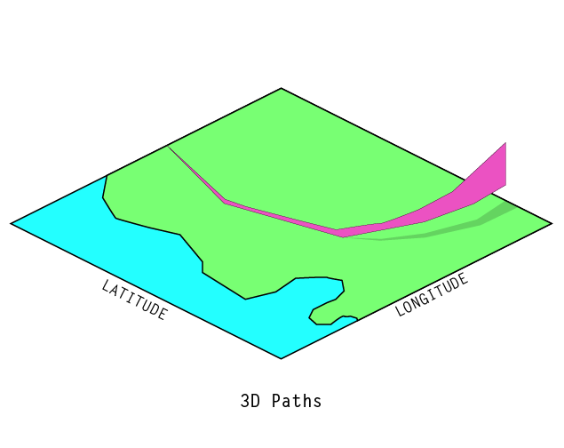
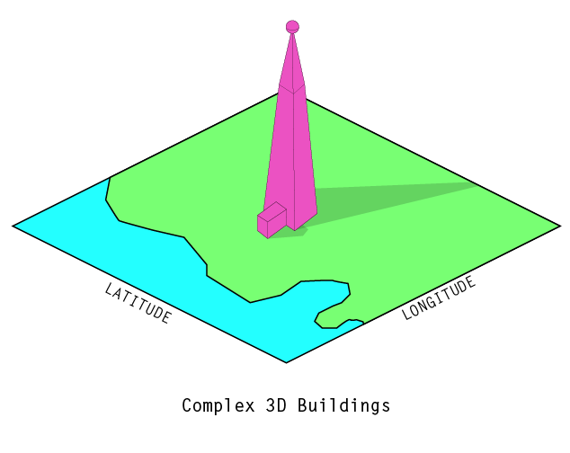
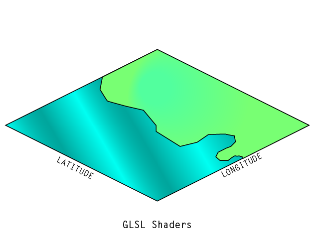
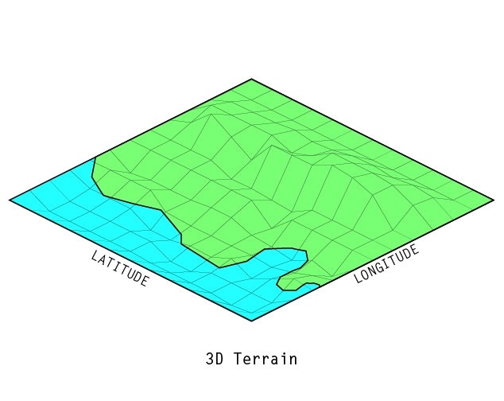

# `threebox`

A three.js plugin for Mapbox GL JS, with support for basic animation and advanced 3D rendering.

## Installation

Add it to your project via `npm`:

`npm install threebox`

or download the bundle from [`dist/threebox.js`](dist/threebox.js) and add include it in a `<script>` tag on your page.

## Documentation

### [`Threebox`](/docs/Threebox.md)

Set up and handle the core translations between a Three.js scene graph and the Mapbox GL JS map.

### [`SymbolLayer3D`](/docs/SymbolLayer3D.md)

The `SymbolLayer3D` object lets you load in a GeoJSON `FeatureCollection` of points and will automatically place 3D models at each point.

## Features
### Current
These features currently have a dedicated interface in `threebox`.

#### :point_right: [SymbolLayer3D 📝](/docs/SymbolLayer3D.md)

### Planned
These features should be possible to implement using Three.js today but would benefit from a more geographic/map-specific interface in a future version of `threebox`.

## Building

`npm run build`

or to continually rebuild as you develop:

`npm run dev`

Both commands will output a bundled in `/dist/threebox.js`.
