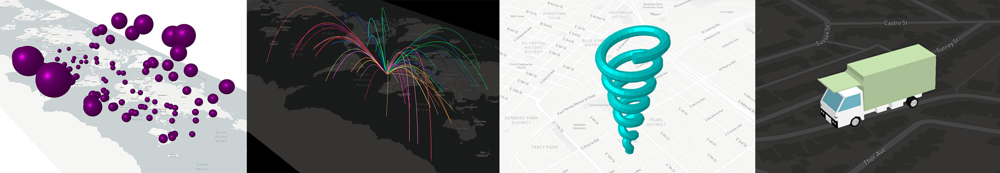

# `threebox`

A three.js plugin for Mapbox GL JS, using the custom layer feature. Provides convenient methods to manage objects in lnglat coordinates, and to synchronize the map and scene cameras.

### Compatibility/Dependencies

- Mapbox v.0.50.0 and later (for custom layer support)
- Three.r94 (already bundled into the Threebox build). If desired, other versions can be swapped in and rebuilt [here](https://github.com/peterqliu/threebox/blob/master/src/three.js), though compatibility is not guaranteed.

### Getting started

Download the bundle from [`dist/threebox.js`](dist/threebox.js) and add include it in a `<script>` tag on your page.

Several introductory examples are [here](https://github.com/peterqliu/threebox/tree/master/examples). To run them, create a `config.js` file with your Mapbox access token, alongside and in the format of [the template](https://github.com/peterqliu/threebox/blob/master/examples/config_template.js).

[Documentation lives here](docs/Threebox.md).

### Contributing

Build the library with `npm run build`, or `npm run dev` to rebuild continuously as you develop. Both commands will output a bundle in `/dist/threebox.js`.

Tests live [here](tests/) -- run `index.html` and check the console for test results.

