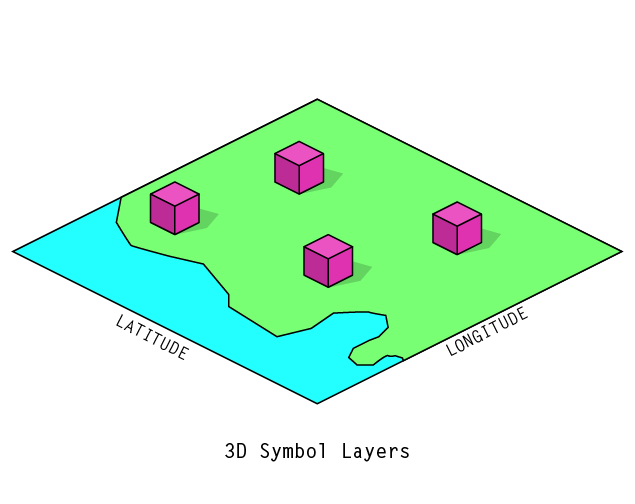

## `SymbolLayer3D`

The `SymbolLayer3D` object lets you load in a GeoJSON FeatureCollection of points and will automatically place 3D models at each point.

Create a 3D symbol layer using this syntax:
```
var symbols = threebox.addSymbolLayer({
  id:             'yourLayerName',
  source:         GeoJSON object | URL,
  modelName:      string | property | generator,
  modelDirectory: string | property | generator,
  rotation:       THREE.Euler | generator,
  scale:          number | property | generator,
  scaleWithMapProjection: boolean,
  key:            property | generator
});
```

### Examples

- [Static symbol layer](../examples/SymbolLayer3D.html)
- [Flocking demo showing fast updates and generator functions](../examples/flocking.html)

### Sources

Pass either an object that contains a GeoJSON `FeatureCollection` or a URL that points to a GeoJSON source as a parameter to `addSymbolLayer`. If you pass a URL, the GeoJSON source will be downloaded and parsed for you.

The `FeatureCollection` should contain a `features` array, and each feature should contain geometry of `type: Point`. `threebox` will place a 3D symbol at the specified longitude/latitude point for each feature.

### Scaling and units

The `scaleWithMapProjection` parameter can help when choosing units and scale factors for 3D symbols on a map. If set to `true` (default), the units of the 3D model file will be interpreted as **meters** at each feature's latitude. Because of distortion inherent in the Mercator projection, this means objects closer to the equator will be automatically scaled to appear smaller than objects closer to the poles. This lets you model your 3D symbols using real-world units and have them appear correctly at all latitudes.

If `scaleWithMapProjection` is set to `false`, the correspondence between your 3D symbol model units and map units can be defined however you see fit.

Units in 3D files coming from different sources tend be somewhat arbitrary and dependent on the context they are rendered into. In `threebox`, a line going from `{latitude: 0, longitude: 0}` to `{latitude: 0, longitude: 360}` (circumnavigating the world once at the equator) would measure 512 units long. Because of this, building- or vehicle-sized objects must generally be scaled down significantly to appear correctly if `scaleWithMapProject` is set to `false`.

### Models

`SymbolLayer3D` currently supports loading 3D models in the [.OBJ format](https://en.wikipedia.org/wiki/Wavefront_.obj_file) with materials specified in a corresponding [.MTL file](https://en.wikipedia.org/wiki/Wavefront_.obj_file#Material_template_library). These are common interchange formats that most 3D modeling programs can export. For proper rendering, it is important to ensure that the model's *normals are correctly facing outwards* and that all *faces are triangulated* (triangulating faces is an option when exporting in many programs). Simplified, low-polygon models work best; it may be necessary to model your 3D symbols specifically for use on a map just as you would design pixel-perfect icons in 2D.

Your `.obj` and `.mtl` files should share the same base file name and you should not include the file extension when specifying the `modelName` parameter. Both the geometry and material files will be loaded automatically based on the `modelName`. Specify the directory where your models are located using the `modelDirectory` parameter.


### Using `property` and `generator` rules for data-driven styling
Notice that some parameters can be set using an optional `property` or `generator` rule. These are two different ways of setting per-feature styles based on your data.

A `property` is an object of the form: `{ property: 'propertyName' }`. This lets you pull a value directly from the `properties` object of each GeoJSON `Feature`.

A `generator` is an object of the form: `{ generator: generatorFunction }`. The `generatorFunction` is a function taking two parameters (`feature`, `index`) that will be run for each GeoJSON `Feature`. This lets you perform custom transformations to turn feature properties into a value. For example:

```
var source = {
  type: "FeatureCollection",
  features: [
    {
      type: "Feature",
      properties: {
        heading: 30,
      },
      geometry: { type: "Point", coordinates: [-122, 37] }
    },
    ...
  ]
}

threebox.addSymbolLayer({
  rotation: { generator: (feature, index) => (
    new Three.Euler(0, 0, feature.properties['heading'] * Math.PI / 180), 'XYZ')
  ) },
  ...
});
```

_(This example uses [ES6 'arrow function'](https://medium.com/ecmascript-2015/arrow-functions-bb08eeb11667) notation for the generator function, but a regular function declaration or reference would work too)_

This generator converts the `heading` property from degrees to radians and uses it to rotate the 3D symbol about its z-axis. (_Note: There are many ways to describe rotations in 3D space with [Euler angles](https://threejs.org/docs/#Reference/Math/Euler) being perhaps the most intuitive and the standard for a `threebox` `SymbolLayer3D`. The exact function used here will depend on your needs._)

### Keys & updating data
To support **fast data updates** as well as **partial updates** of a 3D symbol layer, you can specify a `key` property that will be used to tie unique GeoJSON `Feature` objects to their corresponding object in the 3D scene graph. This way the 3D geometry needs only be created, destroyed, or updated when necessary.

It is best practice to specify the `key` property explicitly. If you don't, the array index of each feature is used as the key and you will not be able to perform reliable partial updates.

For example, assume each feature in your data has a unique `id` property and you create a new `SymbolLayer3D` with `key: { property: 'id' }`. You can then do the following to update your data:

```
symbols.updateSourceData({
  type: "FeatureCollection",
  features: [
    {
      type: "Feature",
      properties: {
        heading: 45,
        id: 'a_unique_feature'
      },
      geometry: {
        type: "Point",
        coordinates: [-123, 38]
      }
    }
  ]
});
```

This will update a single feature in the collection while leaving all the others alone. The pre-existing `rotation`, `scale`, and `modelName` `property` or `generator` rules will automatically be applied again to calculate new values on the updated features.

If this behavior is not desired, `updateSourceData` takes an optional second parameter, `absolute`, that if set to `true` will delete any features not included in the updated GeoJSON.

To remove a feature, use the `SymbolLayer3D.removeFeature` method and specify the `key` of the feature you want to remove.
